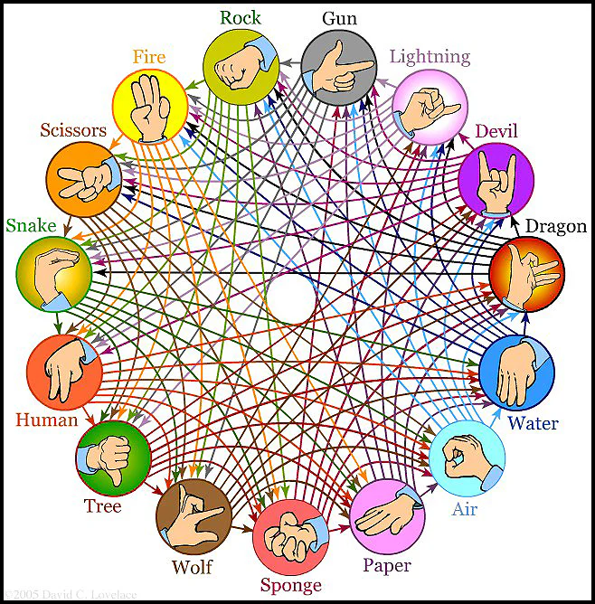
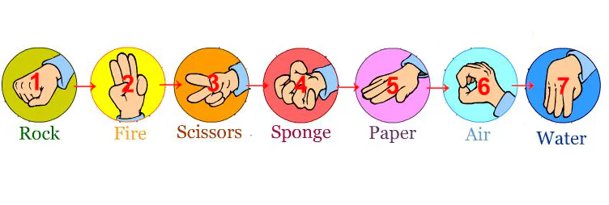
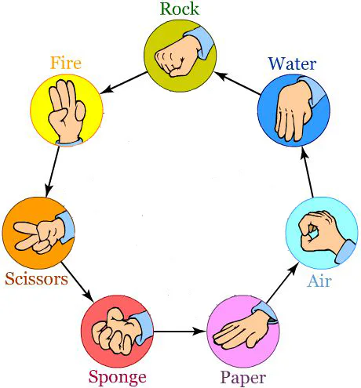
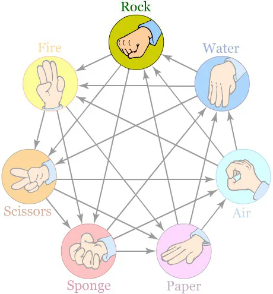
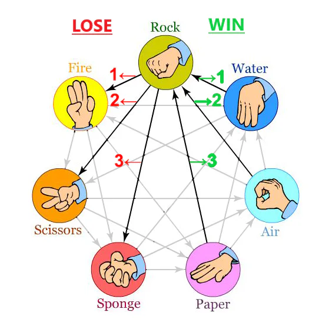
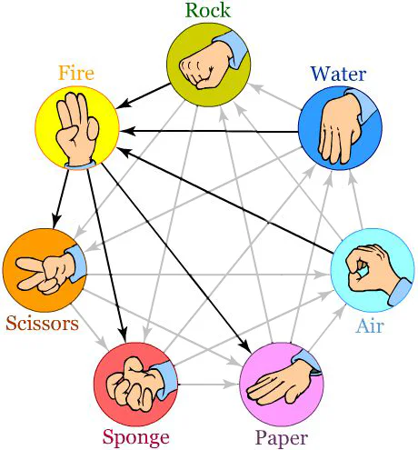

# Stage 5/5: More options

## Description
How about new game rules? The original game has a fairly small choice of options.

The extended version of the game makes it hard to draw. Now, your program should accept alternative lists of options, like `Rock`, `Paper`, `Scissors`, `Lizard`, `Spock`, and so on. You can take the following options (don't take their relations into account; we'll speak about them further on):



In this stage, before the game starts, users can choose the options. After entering the name, they should provide a list of the options separated by a comma. For example:
```text
rock,paper,scissors,lizard,spock
```

If users input an empty line, start the game with default options: `rock`, `paper`, and `scissors`.

Once the game options are defined, output `Okay, let's start`.

Regardless of the chosen options, your program, obviously, should identify which option beats which. You can use the following algorithm.

Let's imagine that the following options are involved in the game "Rock Fire Scissors Sponge Paper Air Water". Order is important.



Let us represent this line as a closed circle:



First, every option produces a draw when opposed to itself.



If Rock opposed Rock - it's a draw.

Secondly, every option beats half of the other options and is defeated by another half.

For "Rock":



In our game, an option will lose to the first half (going counterclockwise in our image) of the other options and win against the remaining half. The first half of the options after Rock are Fire, Scissors, and Sponge, meaning that Rock will lose to any of these three options. The second half - Paper, Air and Water will be beaten by Rock.

For "Fire":



The first half of the options after Fire are Scissors, Sponge and Paper, all of which Fire will lose to. Fire will win against the second half - Air, Water and Rock.

And so on.

What's the general algorithm to determine which options are stronger or weaker? Take the list of options provided by the user and pick the option that you want to know the relationships of. Then create a list of the remaining options starting with the option directly after the chosen one, looping back to the start of the list when you reach the end until you've gathered all but the chosen option. Now, you have another list of options that don't include the user's option with a different order of elements inside. First are the options that follow the chosen one in the original list; then, there are the ones that precede it. So, in this "new" list, the first half of the options defeat the "chosen" option, and the second half is beaten by it.

> Once again, never mind the "links" between the options in the picture above. They are only for illustration purposes

For example, the user's list of options is `rock,paper,scissors,lizard,spock`. You want to know what options are weaker than `lizard`. By looking at the list `spock,rock,paper,scissors` you realize that `spock` and `rock` beat `lizard`. `Paper` and `scissors` are defeated by it. For spock, it'll be almost the same, but it'll get beaten by `rock` and `paper`, and prevail over `scissors` and `lizard`.

Of course, this is not the most efficient way to determine which option prevails over which. You are welcome to try to develop other methods of tackling this problem.

Also note that this game only works fairly when there are an odd number of options to choose from - don't worry about creating logic to handle if an even number of options are present.

## Objectives
Your program should:

- Output a line `Enter your name: `. Users enter their names on the same line (not the one following the output);
- Read the input with the username and output `Hello, <name>`;
- Read rating.txt and check whether it contains an entry with the current username. If yes, use the score specified in the file as a starting point. If not, start the score from `0`;
- Read the input with the list of options for the game (options are separated by comma). If the input is an empty line, play with the default options;
- Output a line `Okay, let's start`;
- Play the game by the rules defined in the previous stages and read the user's input;
- If the input is `!exit`, output `Bye!` and stop the game;
- If the input is the name of the option, then pick a random option and output a line with the result of the game in the following format (`<option>` is the name of the option chosen by the program):
     - Loss: `Sorry, but the computer chose <option>`
     - Draw: `There is a draw (<option>)`
     - Win: `Well done. The computer chose <option> and failed`
- For each draw, add `50` points to the score. For each user's win, add `100` to their score. In case of a loss, don't change the score;
- If input corresponds to anything else, output `Invalid input`;
- Restart the game (with the same options defined before the start of the game).

## Examples
The greater-than symbol followed by a space (`> `) represents the user input. Note that it's not part of the input.

**Example 1**:
```text
Enter your name: > Tim
Hello, Tim
> rock,gun,lightning,devil,dragon,water,air,paper,sponge,wolf,tree,human,snake,scissors,fire
Okay, let's start
> rock
Sorry, but the computer chose air
> !rating
Your rating: 0
> rock
Well done. The computer chose sponge and failed
> !rating
Your rating: 100
> !exit
Bye!
```
**Example 2**:
```text
Enter your name: > Tim
Hello, Tim
> 
Okay, let's start
> rock
Well done. The computer chose scissors and failed
> paper
Well done. The computer chose rock and failed
> paper
There is a draw (paper)
> scissors
Sorry, but the computer chose rock
> !exit
Bye!
```